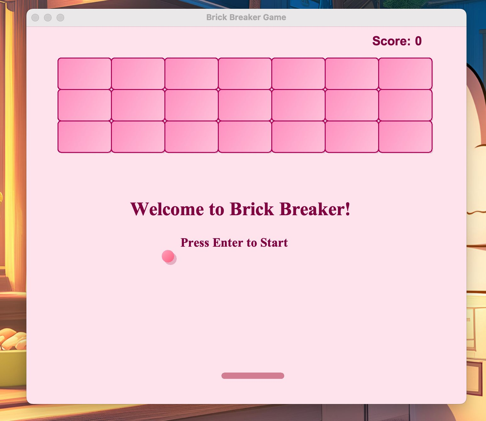
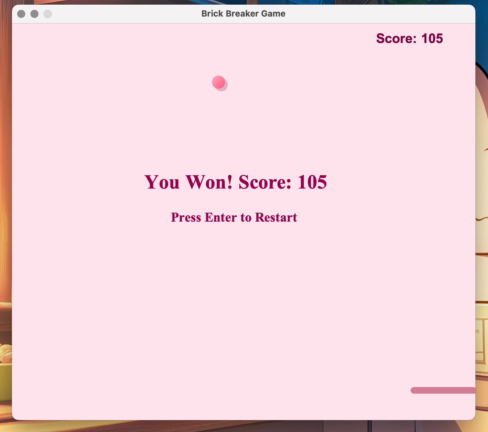
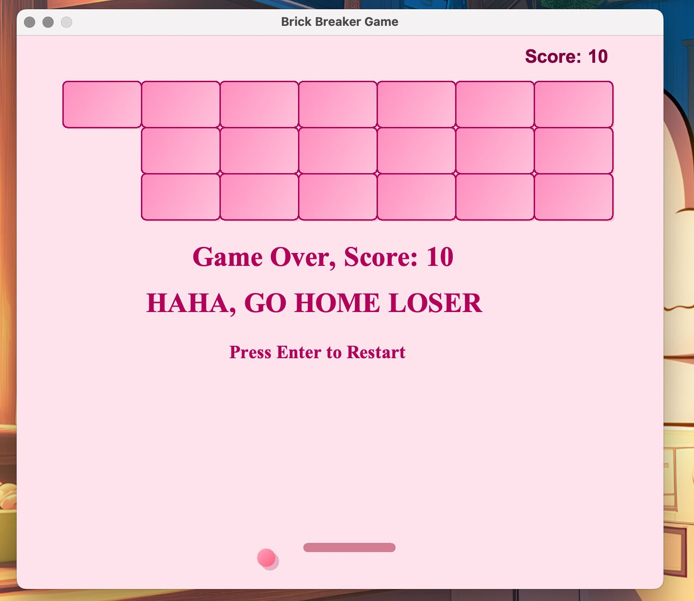

# 🧱 Brick Breaker Game

A 2D Java arcade game built using Java Swing and AWT, following object-oriented design principles.

## 🎮 Features
- Paddle and ball movement
- Brick collision detection
- Score tracking and levels
- Game over and restart functionality
- Immersive audio experience with background music, start chime, victory tune, and game over sound effects.

## 🛠️ Tech Stack
- Java
- Swing and AWT

## 📸 Screenshots

<p align="center">
  
  
  
</p>

## 🚀 How to Run
1. Clone the repo
2. Compile and run `Main.java`
```bash
javac Main.java
java Main
